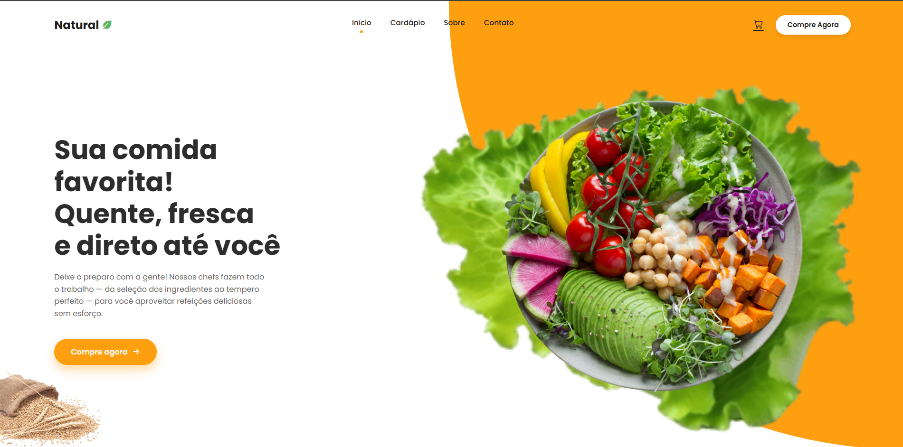

# 🥗 Natural Delivery - Landing Page


> Uma landing page moderna, responsiva e minimalista desenvolvida para um serviço de delivery de comida saudável, focada em design limpo e experiência do usuário.



## 💻 Sobre o Projeto

Este projeto é uma **Landing Page** estática desenvolvida com foco em UI Design moderno. O objetivo foi criar uma interface atraente para um restaurante de comida natural, utilizando conceitos avançados de CSS para formas orgânicas e layout responsivo.

O layout apresenta uma seção Hero com chamada para ação (CTA), imagem de destaque recortada integrada ao fundo e um rodapé informativo.

## ✨ Funcionalidades e Conceitos Aplicados

- **Design Responsivo:** O layout se adapta perfeitamente a Desktops, Tablets e Smartphones (Mobile First mindset).
- **CSS Moderno & Semântico:**
  - Uso de **Variáveis CSS** (`:root`) para fácil manutenção de cores.
  - **Flexbox** e **CSS Grid** para estruturação do layout.
  - **Posicionamento Absoluto** (`position: absolute`) para elementos decorativos e backgrounds.
- **Estilização Avançada:**
  - Formas orgânicas usando `border-radius` assimétrico.
  - Sombras suaves (`box-shadow`) para profundidade.
  - Sobreposição de camadas com `z-index`.

## 🛠 Tecnologias Utilizadas

- **HTML5:** Estrutura semântica do projeto.
- **CSS3:** Estilização completa sem uso de frameworks (CSS Puro).
- **[Phosphor Icons](https://phosphoricons.com/):** Biblioteca de ícones leve e moderna via script.
- **[Google Fonts](https://fonts.google.com/):** Tipografia utilizando a fonte *Poppins*.
- **Git & GitHub:** Controle de versão e hospedagem do código.

## 📂 Estrutura de Arquivos

```text
/restaurante-sabor-divino
│
├── index.html            # Estrutura principal
├── README.md             # Documentação do projeto
└── assets/
    ├── css/
    │   └── style.css     # Estilos globais e responsivos
    └── img/
        ├── prato-destaque.png
        ├── alface.png
        ├── graos.png
        └── ic--baseline-dinner-dining.svg
```
##🚀 Como executar o projeto
Clone este repositório:

```text
git clone [https://github.com/milenafelix/landing-page-restaurante-natural.git](https://github.com/milenafelix/landing-page-restaurante-natural.git)
```
Entre na pasta do projeto:
```
cd landing-page-restaurante-natural
```
Abra o arquivo index.html no seu navegador preferido (Chrome, Firefox, Edge, etc).

##🎨 Design
O design foi pensado para transmitir frescor e naturalidade, utilizando:

Cor Primária: Laranja (#FE9F10) para estimular o apetite.

Tipografia: Poppins para modernidade e legibilidade.

Espaço em Branco: Para manter o visual "clean" e sofisticado.

Referências: https://www.behance.net/gallery/96647171/Foodie-Landing-Page?tracking_source=search_projects|lading+page+website+restaurant&l=0 

##👩‍💻 Autora
Desenvolvido com 🧡 por Milena Felix.
